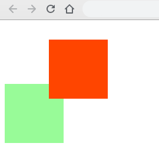
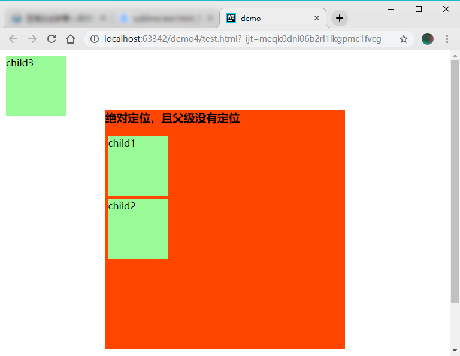
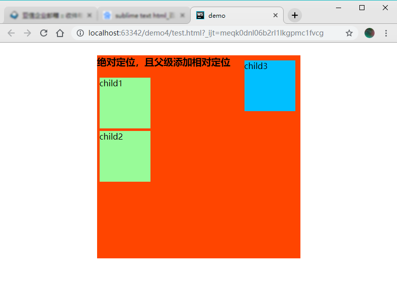

## 元素的定位

————**边偏移**

| 边偏移属性 | 描述                                          |
| ---------- | --------------------------------------------- |
| top        | 顶端偏移量，定义元素对于其父元素上边框的距高  |
| bottom     | 底部偏移量，定义元素对于其父元素下边框的距高  |
| left       | z左侧偏移量，定义元素对于其父元素左边框的距高 |
| right      | 右侧偏移量，定义元素对于其父元素右边框的距高  |

**定位与边偏移可搭配使用 ———— top:30px; left:20px;**

————**定位模式[定位的分类]**

> {position: 属性值; }

| 值       | 描述                                           |
| -------- | ---------------------------------------------- |
| static   | 自动定位[默认方式]                             |
| relative | 相对定位，相对于其原文档流的位置进行定位       |
| absolute | 绝对定位，相对于其上一个已经定位的元素进行定位 |
| fixed    | 固定定位，相对于浏览器窗口进行定位             |

### 1.1 静态定位[static]

静态定位是所有元素的默认定位方式，当position属性顶端取值为static时，可以将元素定位于静态位置。所谓静态位置就是各个元素在HTML文档流中的默认位置。

————网页中的所有元素默认均为静态定位，即是标准流的特性。

————静态定位模式下，无法使用边偏移属性[top、bottom、left、right]来改变元素位置

### 1.2 相对定位[relative]————自恋型

相对定位是将元素相对于它在标准流中的位置进行定位，当position属性的取值为relative时，可以将元素定位于相对位置。

————对元素设置相对定位后，可以通过边偏移属性改变元素的位置，但是它在文档流中的位置仍然保留

————__注意__ 1. 相对定位最重要的一点是，它可以通过边偏移位置，但是原来所占的位置将继续占有；

​	2. 其次，每次移动的位置，是以自己的左上角为基点移动[相对于自己来移动位置]

**[相对定位的盒子中仍然在标准流中，它后面的盒子仍以标准流对待它]————相对定位不脱标**

### 1.3 绝对定位[absolute]————拼爹型

**[注意]** 1. 如果文档可滚动，绝对定位元素会随着它滚动，因为元素最终会相对于正常流的某一部分定位。当position属性的取值为absolute时，可以将元素的定位模式设置为绝对定位。

​	**绝对定位————可以通过边偏移移动位置，但是它是完全脱标，完全不占标准流的位置**

#### 1.3.1 父级没有定位

————若所有父级元素均没有定位，则以浏览器为准对齐[document文档]

#### 1.3.2 父级有定位

————绝对定位将元素依据最近的已经定位[绝对、固定、相对定位]的父元素[祖先]进行定位

#### 1.3.3 子 绝 父 相

————意思：子级是绝对定位，父级使用相对定位

​    绝对定位是将元素依据最近的已经定位[绝对、固定、相对定位]的父元素[祖先]进行定位。即子级是绝对定位，父亲只要是定位即可[不管父亲是绝对定位还是相对定位，甚至是固定定位都可以]，就是说————子绝父绝，子绝父相，都是正确的。

————[**子绝父相的由来**]由以下案例：因为子级是绝对定位，不会占用位置，可以放到父盒子的任意位置。父盒子布局时，需要占有位置，因此只能是相对定位。

> [案例1]利用**子绝父相**构建层叠边角

#### 1.3.4 绝对定位的盒子水平/垂直居中

定位盒子设置水平居中/垂直居中算法：

​	1. 首先left:50% ————子元素相对父元素移动

​	2. 然后再走自己外边距负50%即可

### 1.4 固定定位[fixed]————认死理型

固定定位是绝对定位的一种特殊形式，类似于正方形是特殊的矩形。它是以浏览器窗口作为参照物来定义网页元素。当position属性的取值为fixed时，即可将元素的定位模式设置为固定定位。

当对元素设置固定定位后，它将脱离标准文档流的控制，始终依据浏览器窗口来定义自己的位置。不管浏览器滚动条如何滚动也不管浏览器窗口的大小如何变化，该元素都会始终显示在浏览器窗口的固定位置。

---

固定定位：

​	1. 固定定位的元素跟父亲没有任何关系，只认浏览器；

​	2. 固定定位完全脱标，不占有位置，不随这滚动条滚动。

> [案例2]使用固定定位固定导航栏案例

### 1.5 层叠次序[z-index]

当对多个元素同时设置定位时，定位元素又可能发生重叠

————在CSS中，若想要调整重叠元素的堆叠顺序，可以对定位元素应用**z-index**层叠等属性，其值可为正整数、0、负整数

**[注意]**

​	1.z-index的默认属性值为0，取值越大，定位元素在层叠元素中越居上；
 	2.如果取值相同，则根据书写顺序，后来者居上；
 	3.后面数字一定不能加单位；
​	4.只有相对定位、绝对定位、固定定位有此属性，其余标准流、浮动、静态定位均无此属性，亦不可使用此属性。

### 1.6 四种定位模式的总结

| 定位模式         | 是否脱标占有位置     | 是否可使用边偏移 | 移动位置基准           |
| ---------------- | -------------------- | ---------------- | ---------------------- |
| 静态定位static   | 不脱标，正常模式     | 不可以           | 正常模式               |
| 相对定位relative | 不脱标，占有位置     | 可以             | 相对自身位置移动       |
| 绝对定位absolute | 完全脱标，不占有位置 | 可以             | 相对于定位父级移动位置 |
| 固定定位fixed    | 完全脱标，不占有位置 | 可以             | 相对于浏览器移动位置   |

#### 1.6.1 定位模式的转换

​    跟浮动一样，元素添加了绝对定位和固定定位之后，元素模式也会发生转换。都转换为行内块模式。因此，如行内元素添加了绝对定位或固定定位后，可以不用转换模式，直接给宽和高即可。

### 1.7 元素的隐藏与显示

​    在CSS中有三个显示和隐藏的单词比较常见，我们要区分开，他们分别是display、visibility、overflow。

​    他们的主要目的是让一个元素在页面中消失，但是不在文档源码中删除。、

#### 1.7.1 display显示

display设置或检索对象是否显示和如何显示

display: none[隐藏对象]，与之相反的是display：block除了转换为块级元素之外，同时还有显示元素的意思。

特点：隐藏之后，不在保留位置

#### 1.7.2 visibility可见性

设置或检索是否显示对象

visibility：visible 对象可视

visibility：hidden 对象隐藏

特定：隐藏之后，继续保留原有位置[停职留薪]

#### 1.7.3 overflow溢出

检索或设置当前对象的内容超过其指定高度及宽度时如何管理内容

overflow：visible 不剪切内容也不添加滚动条

overflow：auto 超出自动显示滚动条，不超出不显示滚动条

overflow：hidden 不显示超过对象尺寸的内容，超出的部分隐藏

overflow：scroll 不管超出内容否，总是显示滚动条